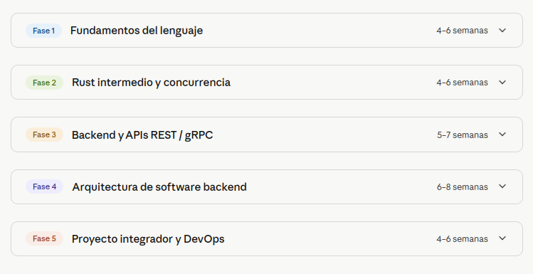

# 🦀 Rust: de Cero a Experto

> **Un recorrido autodidacta por Rust orientado al diseño de software backend.**  
> Este repositorio documenta mi aprendizaje paso a paso — con resúmenes, ejercicios, proyectos y reflexiones personales.  
> Si llegaste acá queriendo aprender Rust, estás en el lugar correcto. Podés seguir este camino junto a mí.

---

## 🗺️ Roadmap general



---

## ¿Por qué Rust?

Rust es un lenguaje de programación de **sistemas** que combina lo mejor de dos mundos:

| Característica | Lo que significa para vos |
|---|---|
| 🔒 **Seguridad de memoria** | El compilador detecta errores de memoria *antes* de que tu programa corra |
| ⚡ **Rendimiento de C/C++** | Sin garbage collector, sin overhead oculto |
| 🧵 **Concurrencia sin data races** | El compilador *garantiza* que tu código paralelo es correcto |
| 📦 **Ecosistema moderno** | Cargo, el gestor de paquetes, es de clase mundial |
| 🤝 **Comunidad excepcional** | Documentación, mensajes de error y foros de primer nivel |

### Rust vs C++ en una tabla

| Aspecto | C++ | Rust |
|---|---|---|
| Seguridad de memoria | ❌ Responsabilidad tuya | ✅ Garantizada por el compilador |
| Data races | ❌ Detectadas en runtime (o nunca) | ✅ Imposibles de compilar |
| Manejo de errores | ⚠️ Excepciones inconsistentes | ✅ `Result` y `Option` explícitos |
| Gestor de paquetes | ❌ Sin estándar claro | ✅ Cargo (excelente) |
| Mensajes del compilador | 😰 Crípticos | 😊 Claros y educativos |
| Ecosistema | ✅ 30+ años de bibliotecas | 🚀 Creciendo muy rápido |

> 💡 **Para el alumno de Ingeniería en Sistemas:** si ya viste Organización del Computador o Sistemas Operativos, Rust va a hacer *click* con conceptos como stack, heap, punteros y gestión de memoria — solo que ahora el compilador los valida por vos.

---

## 🗺️ Mapa del repositorio

```
rust-de-cero-a-experto/
│
├── README.md                  ← estás acá
├── assets/                    ← imágenes y recursos visuales
│
├── fase1-fundamentos/         ← Variables, ownership, structs, enums, errores
│   ├── README.md
│   ├── resumenes/
│   └── ejercicios/
│
├── fase2-intermedio/          ← Traits, generics, async/await, concurrencia
│   ├── README.md
│   ├── resumenes/
│   └── ejercicios/
│
├── fase3-backend/             ← APIs REST, gRPC, bases de datos, auth
│   ├── README.md
│   ├── resumenes/
│   └── proyectos/
│
├── fase4-arquitectura/        ← DDD, hexagonal, CQRS, microservicios
│   ├── README.md
│   ├── resumenes/
│   └── proyectos/
│
└── fase5-devops/              ← Docker, CI/CD, deploy, proyecto final
    ├── README.md
    └── proyecto-final/
```

---

## 📚 Las 5 fases del plan de estudio

El plan está dividido en cinco fases progresivas. Cada una construye sobre la anterior.  
Hacé clic en el nombre de cada fase para ir a su carpeta con el material completo.

---

### [Fase 1 — Fundamentos del lenguaje](./fase1-fundamentos/) · *4 a 6 semanas*


La base de todo. Acá aprendés a "pensar en Rust": cómo el lenguaje maneja la memoria sin garbage collector, y por qué eso es una ventaja enorme.

**Temas principales:**
- Variables, tipos de datos y mutabilidad
- ***Ownership, borrowing y lifetimes*** — el concepto más importante de Rust
- Structs, enums y pattern matching
- Control de flujo y funciones
- Módulos y sistema de paquetes con **Cargo**
- Manejo de errores con `Result` y `Option`

**Recursos utilizados:**
- 📖 [The Rust Book](https://doc.rust-lang.org/book/) — la biblia oficial, gratuita y excelente
- 📺 [No Boilerplate](https://www.youtube.com/@NoBoilerplate) — videos cortos y conceptualmente densos
- 🏋️ [Rustlings](https://rustlings.cool/) — ejercicios interactivos en la terminal

---

### [Fase 2 — Rust intermedio y concurrencia](./fase2-intermedio/) · *4 a 6 semanas*


Con las bases sólidas, entramos al Rust más expresivo y potente. La concurrencia sin data races es una de las propuestas de valor más fuertes del lenguaje.

**Temas principales:**
- Traits y generics
- Closures e iteradores
- Smart pointers: `Box`, `Rc`, `Arc`, `RefCell`
- Concurrencia: threads y canales
- ***Async/await con Tokio*** — el runtime asíncrono más usado
- Testing unitario e integración

**Recursos utilizados:**
- 📺 [Jon Gjengset](https://www.youtube.com/@JonGjengset) — el canal más técnico y profundo de Rust
- 📖 [Tutorial oficial de Tokio](https://tokio.rs/tokio/tutorial)
- 🏋️ [Exercism — Rust track](https://exercism.org/tracks/rust)

---

### [Fase 3 — Backend y APIs REST / gRPC](./fase3-backend/) · *5 a 7 semanas*


Acá conectamos Rust con el mundo real: servidores HTTP, bases de datos, autenticación y comunicación entre servicios.

**Temas principales:**
- Framework **Axum** o **Actix-web** para APIs HTTP
- Routing, middlewares y manejo de errores HTTP
- Bases de datos con **SQLx** o **Diesel**
- Autenticación: JWT y sesiones
- ***gRPC con Tonic*** — comunicación eficiente entre microservicios
- Serialización con **Serde**

**Recursos utilizados:**
- 📺 [Jeremy Chone](https://www.youtube.com/@jeremychone) — especializado en backend con Rust
- 💻 [Ejemplos oficiales de Axum](https://github.com/tokio-rs/axum/tree/main/examples)
- 📖 [Zero To Production in Rust](https://www.zero2prod.com/) — referencia para backend profesional

---

### [Fase 4 — Arquitectura de software backend](./fase4-arquitectura/) · *6 a 8 semanas*


El objetivo final: diseñar sistemas robustos, mantenibles y escalables. Esta fase trasciende el lenguaje — los patrones sirven en cualquier stack.

**Temas principales:**
- ***Domain-Driven Design (DDD)*** aplicado a Rust
- Arquitectura hexagonal / ports & adapters
- CQRS y Event Sourcing
- Microservicios y mensajería con **Kafka** y **RabbitMQ**
- Observabilidad: trazas, métricas y logs con **OpenTelemetry**
- Diseño de APIs robustas y versionado

**Recursos utilizados:**
- 📺 [Let's Get Rusty](https://www.youtube.com/@letsgetrusty)
- 📖 [Martin Fowler — Patterns of Enterprise Architecture](https://martinfowler.com/architecture/)
- 📺 Canales de System Design (arquitectura agnóstica al lenguaje)

---

### [Fase 5 — Proyecto integrador y DevOps](./fase5-devops/) · *4 a 6 semanas*


El cierre del ciclo: llevar una aplicación completa a producción, con todas las prácticas modernas de ingeniería de software.

**Temas principales:**
- Containerización con **Docker**
- CI/CD con **GitHub Actions**
- Benchmarking y profiling en Rust
- Deploy en cloud: **Fly.io**, Railway, AWS
- ***Proyecto final completo:*** API + Base de datos + Autenticación + Deploy

**Recursos utilizados:**
- 📺 [Code to the Moon](https://www.youtube.com/@codetothemoon) — proyectos prácticos en Rust
- 📖 [Fly.io — Rust deployment guide](https://fly.io/docs/rust/)
- 💻 [Awesome Rust](https://github.com/awesome-rust-com/awesome-rust) — colección curada de bibliotecas

---

## 🛠️ Configuración del entorno

Antes de arrancar, necesitás tener esto instalado:

### 1. Rust y Cargo

```bash
# Instalar rustup (gestor de versiones de Rust)
curl --proto '=https' --tlsv1.2 -sSf https://sh.rustup.rs | sh

# Verificar instalación
rustc --version
cargo --version
```

### 2. Rustlings (ejercicios de la Fase 1)

```bash
cargo install rustlings
rustlings init
cd rustlings
rustlings
```

### 3. VS Code + extensiones recomendadas

| Extensión | Para qué sirve |
|---|---|
| `rust-lang.rust-analyzer` | Autocompletado, errores en tiempo real, navegación |
| `tamasfe.even-better-toml` | Sintaxis de archivos `Cargo.toml` |

```bash
# Instalar desde la terminal
code --install-extension rust-lang.rust-analyzer
code --install-extension tamasfe.even-better-toml
```

---

## 📖 Bibliografía y recursos generales

### Libros y documentación (gratuitos)

| Recurso | Descripción | Nivel |
|---|---|---|
| [The Rust Book](https://doc.rust-lang.org/book/) | Documentación oficial, el mejor punto de partida | Principiante |
| [Rust by Example](https://doc.rust-lang.org/rust-by-example/) | El mismo contenido del libro pero con ejemplos de código | Principiante |
| [The Rustonomicon](https://doc.rust-lang.org/nomicon/) | Rust "unsafe" y detalles de bajo nivel | Avanzado |
| [Async Book](https://rust-lang.github.io/async-book/) | Programación asíncrona en profundidad | Intermedio |
| [Zero To Production](https://www.zero2prod.com/) | Backend profesional con Rust (parcialmente gratuito) | Intermedio/Avanzado |

### Canales de YouTube

| Canal | Estilo | Mejor para |
|---|---|---|
| [No Boilerplate](https://www.youtube.com/@NoBoilerplate) | Videos cortos y densos, muy bien guionados | Conceptos de Fase 1 y 2 |
| [Jon Gjengset](https://www.youtube.com/@JonGjengset) | Técnico y profundo, streams largos | Rust intermedio/avanzado |
| [Let's Get Rusty](https://www.youtube.com/@letsgetrusty) | Amigable y didáctico | Principiantes |
| [Jeremy Chone](https://www.youtube.com/@jeremychone) | Backend y arquitectura | Fases 3 y 4 |
| [Code to the Moon](https://www.youtube.com/@codetothemoon) | Proyectos prácticos completos | Fase 5 |

### Plataformas de práctica

| Plataforma | Descripción |
|---|---|
| [Rustlings](https://rustlings.cool/) | Ejercicios interactivos en la terminal, ideales para la Fase 1 |
| [Exercism — Rust track](https://exercism.org/tracks/rust) | Ejercicios con feedback de mentores, gratuito |
| [Advent of Code](https://adventofcode.com/) | Desafíos algorítmicos, excelente para practicar |

---

## 🧭 Cómo usar este repositorio

Si sos nuevo en Rust, el camino recomendado es:

1. **Leé este README completo** para tener el panorama general
2. **Entrá a `fase1-fundamentos/`** y seguí el README de esa carpeta
3. **Instalá el entorno** (Rust + VS Code + extensiones)
4. **Arrancá con Rustlings** en paralelo mientras ves los videos
5. **Avanzá fase por fase**, sin saltear — cada una construye sobre la anterior

> ⚠️ **Consejo importante:** no te frustres con el *borrow checker* al principio. Todos los que aprendemos Rust pasamos por eso. El compilador no es tu enemigo — es el mejor profesor que vas a tener.

---

## 📝 Sobre este repositorio

Este repo es un **diario de aprendizaje público**. Los resúmenes son míos, escritos con mis propias palabras, y los ejercicios los fui haciendo yo mismo. Si encontrás errores conceptuales o mejoras posibles, abrí un issue — aprendemos juntos.

**Stack de este repositorio:**
- Lenguaje: Rust 🦀
- Gestor de paquetes: Cargo
- Editor: VS Code + rust-analyzer
- Ejercicios: Rustlings + Exercism
- Objetivo final: arquitectura y diseño de software backend

---

*Última actualización: 2026 · Juan · [@skynet-tp]*
