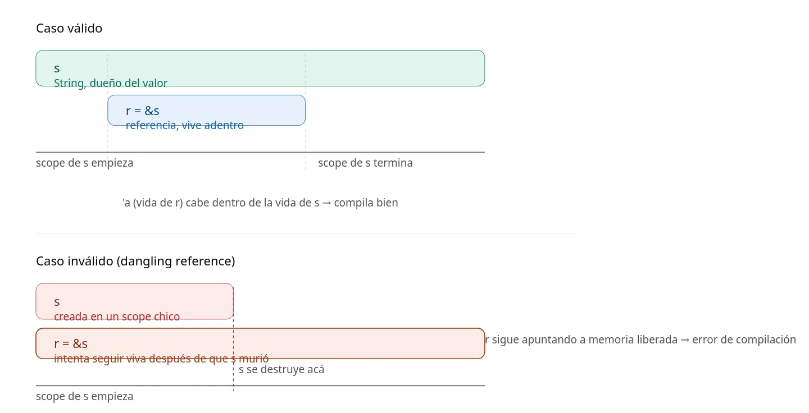

# 🦀 Ownership, Borrowing & Lifetimes en Rust

> **El trío de conceptos que hace a Rust único** — sin garbage collector, sin `free()` manual,
> sin data races. Todo verificado en tiempo de compilación.

---

## 📑 Tabla de contenidos

1. [Los tres conceptos en una línea](#los-tres-conceptos-en-una-línea)
2. [Ownership (Propiedad)](#-ownership-propiedad)
3. [Borrowing (Préstamo)](#-borrowing-préstamo)
4. [Lifetimes (Tiempos de vida)](#-lifetimes-tiempos-de-vida)
5. [Las reglas de oro](#-las-reglas-de-oro)
6. [Los tres conceptos juntos en código](#-los-tres-conceptos-juntos-en-código)
7. [Ejercicios resueltos](#-ejercicios-resueltos)

---

## Los tres conceptos en una línea

| Concepto | Analogía | Qué garantiza |
|---|---|---|
| **Ownership** | Cada libro tiene un único dueño | La memoria se libera automáticamente cuando el dueño sale de scope |
| **Borrowing** | Prestar el libro sin cederlo | Podés leer (o modificar) sin transferir la propiedad |
| **Lifetimes** | El libro prestado no puede sobrevivir a la biblioteca | Una referencia nunca apunta a memoria ya liberada |

---

## 📦 Ownership (Propiedad)

**Cada valor en memoria tiene un único dueño** — una variable. Cuando esa variable sale de
scope, Rust libera la memoria automáticamente. No hay garbage collector, no hay `free()` manual:
el compilador lo resuelve en tiempo de compilación.

### Reglas

1. Cada valor tiene **un único dueño**.
2. Solo puede haber **un dueño a la vez**.
3. Cuando el dueño sale de scope, el valor se **destruye** (`drop`).

### Move vs Copy

```rust
// String vive en el heap → se MUEVE, no se copia
let s1 = String::from("hola");
let s2 = s1;
// println!("{}", s1); ❌ s1 ya no es válido — la propiedad se transfirió a s2

// i32 es un tipo Copy → se COPIA, ambas variables son válidas
let x1 = 5;
let x2 = x1;
println!("{}, {}", x1, x2); // ✅
```

> 💡 **Regla rápida:** tipos simples (`i32`, `bool`, `char`, `f64`…) implementan `Copy`.
> Tipos con datos en el heap (`String`, `Vec`, etc.) se **mueven**.

---

## 🤝 Borrowing (Préstamo)

En vez de transferir la propiedad, podés **prestar** un valor con una referencia (`&`).
Es como prestarle un libro a alguien: vos seguís siendo el dueño.

### Referencia inmutable (`&T`)

```rust
fn main() {
    let s = String::from("rustlings");
    let largo = calcular_largo(&s); // prestamos s, no lo movemos
    println!("'{}' tiene {} caracteres", s, largo); // ✅ s sigue siendo válido
}

fn calcular_largo(s: &str) -> usize {
    s.len()
} // s sale de scope acá, pero como es referencia, no se destruye nada
```

### Referencia mutable (`&mut T`)

```rust
let mut s = String::from("rust");
cambiar(&mut s);
println!("{}", s); // "rust!"

fn cambiar(s: &mut String) {
    s.push_str("!");
}
```

### Reglas del Borrowing

```
✅  Muchas referencias inmutables al mismo tiempo   → OK
✅  Una sola referencia mutable                     → OK
❌  Una mutable + cualquier otra simultánea         → ERROR
```

> 🔒 Esto elimina los **data races en tiempo de compilación**: si nadie puede escribir
> mientras otro lee, no hay condición de carrera posible.

### Non-Lexical Lifetimes (NLL) — Rust moderno

Una referencia **muere en el último lugar donde se usa**, no donde cierra el scope.
Esto hace que el siguiente código sea válido:

```rust
let mut s = String::from("hola");

let r1 = &mut s;
println!("{}", r1); // r1 se usa por última vez acá → muere acá

let r2 = &mut s;   // ✅ válido, r1 ya no está viva
println!("{}", r2);
```

---

## ⏳ Lifetimes (Tiempos de vida)

Los lifetimes son la forma que tiene el compilador de asegurarse de que una referencia
prestada **no le sobreviva al dueño original**. En otras palabras: que nunca termines con
un puntero colgante (*dangling pointer*).

### Diagrama visual

 


### ¿Cuándo necesitás anotar `'a` explícitamente?

La gran mayoría del tiempo **no necesitás escribir lifetimes a mano** — Rust los infiere
mediante las reglas de **lifetime elision**. Solo tenés que anotarlos cuando:

- Una función **recibe múltiples referencias y devuelve una de ellas**
- Un `struct` **guarda referencias** adentro
- Algunos métodos complejos

### Lifetime explícito — el caso más común

```rust
fn mas_largo<'a>(x: &'a str, y: &'a str) -> &'a str {
//           ────────────────────────────────────────
//           x, y y el retorno comparten la misma vida
    if x.len() > y.len() { x } else { y }
}
```

La firma dice: *"el resultado va a vivir exactamente lo que viva la **más corta** de las dos
referencias que recibo"*. Sin `'a`, el compilador no puede saber si está devolviendo `x` o `y`
(eso depende del runtime), ni por cuánto tiempo es válido el resultado.

### Qué pasa sin el lifetime

```rust
fn main() {
    let s1 = String::from("largo string es largo"); // vive hasta el final de main
    let resultado;
    {
        let s2 = String::from("corto");             // vive solo hasta }
        resultado = mas_largo(s1.as_str(), s2.as_str());
        // resultado PODRÍA ser &s2, que muere en }
    }
    println!("{}", resultado); // ❌ resultado podría apuntar a s2 ya destruida
}
```

**Solución 1** — eliminar el scope interno:

```rust
let s1 = String::from("largo string es largo");
let s2 = String::from("corto");
let resultado = mas_largo(s1.as_str(), s2.as_str());
println!("El más largo es {}", resultado); // ✅
```

**Solución 2** — usar `resultado` dentro del scope donde `s2` vive:

```rust
let s1 = String::from("largo string es largo");
{
    let s2 = String::from("corto");
    let resultado = mas_largo(s1.as_str(), s2.as_str());
    println!("El más largo es {}", resultado); // ✅ antes de que s2 muera
}
```

---

## 📋 Las reglas de oro

### Ownership

| # | Regla |
|---|---|
| 1 | Cada valor tiene **un único dueño** |
| 2 | Solo puede haber **un dueño a la vez** |
| 3 | Cuando el dueño sale de scope, el valor se **destruye** |

### Borrowing

| # | Regla |
|---|---|
| 1 | Podés tener **muchas `&T`** (referencias inmutables) al mismo tiempo |
| 2 | **O** una sola `&mut T` (referencia mutable) |
| 3 | Las referencias siempre tienen que ser **válidas** (nunca dangling) |

### Lifetimes

| # | Regla |
|---|---|
| 1 | El compilador los infiere casi siempre (**lifetime elision**) |
| 2 | Solo anotás `'a` cuando la función recibe **múltiples referencias y devuelve una** |
| 3 | El resultado vive lo que viva la referencia **más corta** de las que recibe |

---

## 🔧 Los tres conceptos juntos en código

```rust
fn main() {
    // ── OWNERSHIP ──────────────────────────────────────────
    let s1 = String::from("hola");

    // MOVE: la propiedad se transfiere a s2, s1 ya no es válido
    let s2 = s1;
    // println!("{}", s1); ❌ error: value borrowed after move

    // ── BORROWING ──────────────────────────────────────────
    // Prestamos s2 sin mover la propiedad
    let len = calcular_largo(&s2);
    println!("'{}' tiene {} caracteres", s2, len); // ✅ s2 sigue siendo válido

    // ── BORROWING MUTABLE ──────────────────────────────────
    // Solo una referencia mutable a la vez
    let mut s3 = String::from("rust");
    cambiar(&mut s3);
    println!("{}", s3); // "rust!"
}

fn calcular_largo(s: &str) -> usize {
    s.len()
} // s sale de scope, pero como es referencia, no se destruye nada

fn cambiar(s: &mut String) {
    s.push_str("!");
}
```

---

## 🏋️ Ejercicios resueltos

### Ejercicio 1 — Ownership básico

**Problema:** el código intenta usar `s1` después de moverlo a `s2`.

```rust
// ❌ No compila
fn main() {
    let s1 = String::from("hola mundo");
    let s2 = s1;
    println!("{}, {}", s1, s2);
}
```

**Solución A — préstamo** *(la más idiomática)*:

```rust
fn main() {
    let s1 = String::from("hola mundo");
    let s2 = &s1;                          // s2 toma prestado, no toma propiedad
    println!("{}, {}", s1, s2); // ✅
}
```

**Solución B — clonar** *(solo si necesitás dos copias independientes en memoria)*:

```rust
let s2 = s1.clone(); // crea un segundo String en el heap — costoso, usalo con criterio
```

---

### Ejercicio 2 — Funciones y ownership

**Problema:** la función se lleva la propiedad del `String` y no la devuelve.

```rust
// ❌ No compila
fn main() {
    let s = String::from("rustlings");
    let largo = calcular_largo(s);      // s se mueve adentro de la función
    println!("'{}' tiene {} caracteres", s, largo); // s ya no existe
}

fn calcular_largo(s: String) -> usize {
    s.len()
}
```

**Solución — pasar una referencia**:

```rust
fn main() {
    let s = String::from("rustlings");
    let largo = calcular_largo(&s);    // prestamos s, no lo movemos
    println!("'{}' tiene {} caracteres", s, largo); // ✅
}

fn calcular_largo(s: &str) -> usize { // &str es más flexible que &String
    s.len()
}
```

> 💡 Cuando una función solo **lee** un `String`, la convención idiomática es recibir `&str`
> en lugar de `&String` — acepta tanto `&String` como literales `"texto"`.

---

### Ejercicio 3 — Referencias mutables, una sola a la vez

**Problema:** dos referencias mutables activas simultáneamente.

```rust
// ❌ No compila
fn main() {
    let mut s = String::from("hola");
    let r1 = &mut s;
    let r2 = &mut s; // dos &mut al mismo tiempo
    println!("{}, {}", r1, r2);
}
```

**Solución A — hacerlas inmutables** *(si no necesitás modificar)*:

```rust
let r1 = &s;
let r2 = &s;
println!("{}, {}", r1, r2); // ✅ muchas & al mismo tiempo está permitido
```

**Solución B — NLL, usar una antes de crear la otra** *(la más idiomática)*:

```rust
let mut s = String::from("hola");

let r1 = &mut s;
println!("{}", r1); // r1 muere acá (último uso)

let r2 = &mut s;   // ✅ r1 ya no existe
println!("{}", r2);
```

---

### Ejercicio 4 — Mezclar inmutable y mutable

**Problema:** `&` y `&mut` activas al mismo tiempo.

```rust
// ❌ No compila
fn main() {
    let mut s = String::from("rust");
    let r1 = &s;
    let r2 = &s;
    let r3 = &mut s; // no podés tener & y &mut activas a la vez
    println!("{}, {}, y {}", r1, r2, r3);
}
```

**Solución — terminar las inmutables antes de crear la mutable**:

```rust
fn main() {
    let mut s = String::from("rust");

    let r1 = &s;
    let r2 = &s;
    println!("{}, {}", r1, r2); // r1 y r2 mueren acá (último uso)

    let r3 = &mut s;            // ✅ ahora no hay conflicto
    println!("{}", r3);
}
```

---

### Ejercicio 5 — Dangling reference

**Problema:** la función devuelve una referencia a un valor que se destruye al salir de ella.

```rust
// ❌ No compila
fn main() {
    let referencia = crear_referencia_invalida();
    println!("{}", referencia);
}

fn crear_referencia_invalida() -> &String {
    let s = String::from("texto temporal");
    &s // s nace acá adentro y muere al terminar la función
}
```

**Solución — devolver el valor, no una referencia**:

```rust
fn crear_string() -> String {
    let s = String::from("texto temporal");
    s // transferimos la propiedad hacia afuera, no devolvemos una referencia
}
```

> ⚠️ Si devolvés `&s`, estarías devolviendo una referencia a memoria ya liberada —
> un *dangling pointer*. Rust directamente no te deja compilar esto.

---

### Ejercicio 6 — Lifetime explícito

**Problema:** `resultado` puede ser una referencia a `s2`, que muere antes del `println!`.

```rust
// ❌ No compila
fn main() {
    let s1 = String::from("largo string es largo");
    let resultado;
    {
        let s2 = String::from("corto");
        resultado = mas_largo(s1.as_str(), s2.as_str());
    } // s2 muere acá
    println!("El más largo es {}", resultado); // resultado podría apuntar a s2 muerta
}

fn mas_largo<'a>(x: &'a str, y: &'a str) -> &'a str {
    if x.len() > y.len() { x } else { y }
}
```

**Solución — que ambas referencias vivan lo mismo**:

```rust
fn main() {
    let s1 = String::from("largo string es largo");
    let s2 = String::from("corto");                // s1 y s2 viven lo mismo
    let resultado = mas_largo(s1.as_str(), s2.as_str());
    println!("El más largo es {}", resultado); // ✅
}
```

---

## 🧠 Resumen mental

```
¿Necesito la propiedad?     → Mover (o clonar si necesito dos copias)
¿Solo necesito leer?        → &T  (referencia inmutable)
¿Necesito modificar?        → &mut T  (referencia mutable, solo una a la vez)
¿Devuelvo una referencia
 de entre varias que recibo? → Anotar 'a explícitamente
```

> **Cuando el compilador te pida `'a`**, ya sabés exactamente qué te está preguntando:
> *"¿de cuál de estas referencias viene lo que devolvés?"*

---

*Notas de estudio — Rust desde cero · Serie: El sistema de tipos*
